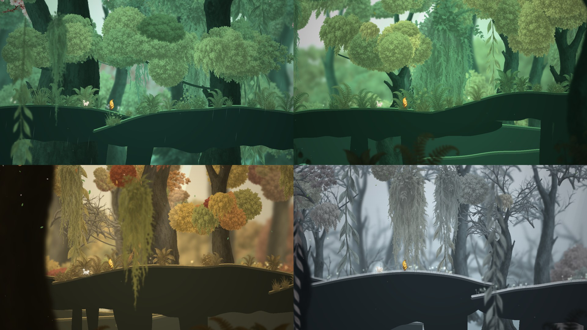

# Banana的岁时漫游 · A Year-Long Walk Through the Forest

> 一条走不完的林间树枝路。Banana 带着一只白猫，沿着巨树的枝干慢慢走过 24 个节气；走完一年，长大一岁，再从立春出发。没有目标，没有失败，只有风景、季节和沿路的小事。
>
> An endless walk along giant tree limbs through the 24 solar terms of the Chinese calendar. Banana and a small white cat grow one year older every time the forest comes back to spring. No goals, no failing — just weather, light and small encounters.

**▶ 在线试玩 / Play now: https://haochen2115.github.io/four-season-with-banana/**



这是一个 vibe coding 作品：整个游戏（渲染、世界生成、节气系统、音效）由 Claude Code 写成，植物贴图由图像生成工具生成。

## 玩法 / Controls

| 键 | 作用 |
| --- | --- |
| A / D 或 ← / → | 慢慢走 |
| Shift | 小跑 |
| 空格 | 跳一下（树枝之间的小落差会自动跨过） |
| E 或 ↓ | 坐下 / 起身。坐久一点，小猫会睡着 |
| R | 自动漫游，任意方向键接管 |
| J | 岁时手记：每年走过的节气、遇见的小事；← → 翻年 |
| N | 声音开关 |
| F2 | 隐藏界面，纯看风景 |
| 触屏 | 按住画面左 / 右侧行走，点中间坐下 |

进度（位置、年龄、历年手记、彩蛋）保存在浏览器 localStorage。一个节气约 30 秒，一年约 12 分钟。

## 本地运行 / Run locally

```bash
git clone https://github.com/haochen2115/four-season-with-banana.git
cd four-season-with-banana
python3 dev_server.py 8321      # 或双击 开始漫游.command
```

然后打开 http://127.0.0.1:8321/ 。纯静态页面，没有构建步骤；PixiJS 7 已放在 `vendor/`。

## 它是怎么做的 / How it works

- **一套渲染语言贯穿远近。** 没有任何一张背景图。远林、中远、中景、背景枝、行走枝、近景巨树、前景蕨草共七层视差。所有植物贴图（叶簇、樱花、枯枝、藤蔓、松萝、树干、蕨草）都是亮度蒙版，运行时按景深向雾色混合、按季节着色：远处发青发亮，近处沉成剪影，前后景不会割裂。远景与前景各自预先模糊出景深。
- **无尽且确定。** 树枝路、树木、藤蔓全部由世界坐标的哈希决定，走多远都会生成，回头也一模一样（`src/world.js`、`src/layers.js`）。
- **24 节气连续变化。** `src/season.js` 里每个节气一组关键帧（天空、雾、叶色、枝色、光照、花量、叶量、金黄、枯枝、雪、雨、雾、萤火、夜色、水），沿路程平滑插值。春樱、夏荫、秋金、冬雪与夜晚都发生在同一片森林里；大寒融雪接回立春，跨年只是一行淡淡飘过的字。
- **活着的空气。** 光束、尘埃、落叶、花瓣、雨丝、雪片、萤火按气候连续增减；溪流在路旁出现时水面会亮起来，中景偶有瀑布。
- **小猫与彩蛋。** 小猫跟随、等待、打盹；归鸟、蝴蝶、流星、雪夜灯笼、蒲公英等相遇随机出现，记入手记。
- **声音。** WebAudio 程序化生成风、溪水、鸟鸣、脚步和一组缓慢的和弦垫音，没有外部音频文件。
- **性能。** 稳定运行时每帧约 2 ms、约 65 个绘制调用：贴图打包进图集，`Graphics` 抬高了批处理阈值，发光元素单独分组。

```
index.html          页面与界面样式
src/main.js         启动、图层配置、相机、天空、水面、输入、存档
src/layers.js       视差图层与程序化植被 / 树枝 / 瀑布
src/season.js       24 节气文本与气候关键帧
src/world.js        树枝路生成（世界坐标 → 地面高度）
src/entities.js     Banana 与小猫
src/fx.js           天气粒子与光束
src/eggs.js         彩蛋相遇
src/audio.js        程序化环境音
src/ui.js           DOM 界面
assets/sprites/     贴图（说明见其中的 PROVENANCE.md）
```

## 素材 / Assets

植物、树干、小猫贴图由图像生成工具生成后抠成透明底，Banana 行走序列是作者自己的角色。详见 [assets/sprites/PROVENANCE.md](assets/sprites/PROVENANCE.md)。字体使用 Google Fonts 的 Noto Serif SC，PixiJS 以 MIT 协议分发。

## License

MIT © haochen2115
